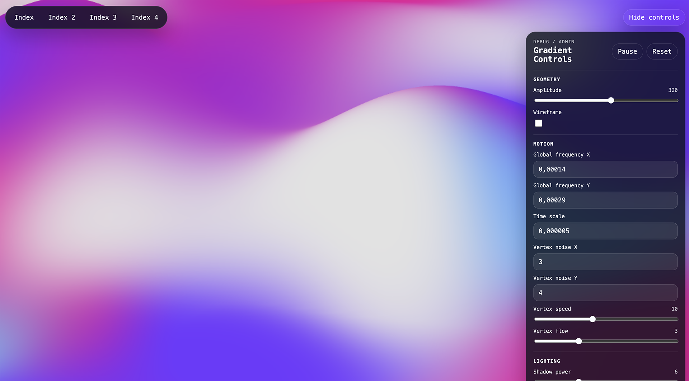

# Gradient Animation

<!-- workspace-hub:cover:start -->

<!-- workspace-hub:cover:end -->

Static WebGL gradient demos based on the Stripe-style animated canvas effect.

## What Is Here
- `index.html`: demo variant 1
- `index-2.html`: demo variant 2
- `index-3.html`: demo variant 3
- `index-4.html`: demo variant 4
- `Gradient.js`: rendering engine and runtime control API
- `controls.js`: shared debug/admin overlay and page navigation
- `controls.css`: shared overlay styling

## How To Run
- Open any of the HTML files directly in a browser, or serve the folder from a simple local web server.
- Each page renders a full-screen canvas and mounts the same debug/admin overlay.

## Debug And Admin Controls
- Top navigation switches between `index.html`, `index-2.html`, `index-3.html`, and `index-4.html`.
- The control panel lets you adjust:
  - amplitude
  - wireframe mode
  - global noise frequency X/Y
  - time scale
  - vertex noise frequency X/Y
  - vertex noise speed
  - vertex noise flow
  - shadow power
  - darken-top toggle
  - all four gradient colors
- `Pause` / `Play` toggles animation.
- `Reset` restores the state captured at page load.
- `Hide controls` collapses the panel.

## Extra Debugging
- Add `?debug=webgl` to the page URL to enable console-side WebGL debug logging from `Gradient.js`.
- This is log output only; it is separate from the on-page admin overlay.

## Runtime API
The `Gradient` instance now exposes setters that `controls.js` uses directly:

- `setAmplitude(value)`
- `setGlobalNoiseFrequency(freqX, freqY)`
- `setGlobalNoiseSpeed(value)`
- `setVertexNoiseFrequency(freqX, freqY)`
- `setVertexNoiseSpeed(value)`
- `setVertexNoiseFlow(value)`
- `setShadowPower(value)`
- `setDarkenTop(enabled)`
- `setWireframe(enabled)`
- `setPlaying(playing)`
- `setColor(index, hexValue)`
- `getState()`
- `applyState(state)`

## Notes
- This project is static and does not use a build step.
- State is not persisted across reloads.
- The HTML files currently have inconsistent `<title>` text versus file names; functionality is unaffected.
